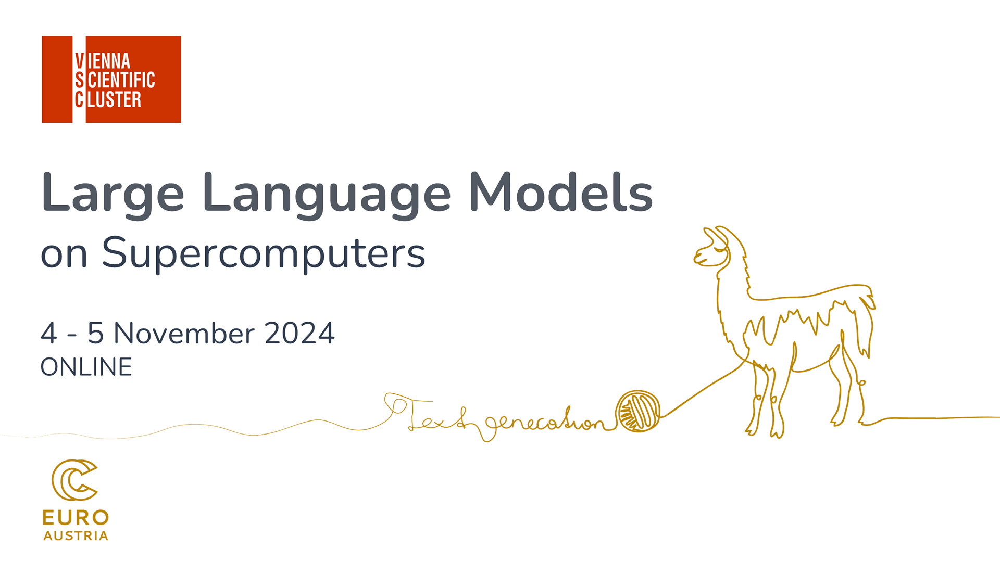

## Table of Contents
1. [Description](#description)
2. [Information](#information)
3. [Certificate](#certificate)
4. [License](#license)

## Description

During the last three years, interest in Large Language Models (LLMs) has experienced a meteoric rise, leaving virtually no domain untouched. The complexity of the models themselves, however, has increased to such an extent, that access to powerful computing resources has become a requirement for anyone wanting to develop products with this novel approach.

In this intensive two half-day course, participants will dive into the world of LLMs and their development on supercomputers. From covering the fundamentals to hands-on implementations, this course offers a comprehensive exploration of LLMs, including cutting-edge techniques and tools such as parameter-efficient fine-tuning (PEFT), quantization, zero redundancy optimizers (ZeRO), fully sharded data parallelism (FSDP), DeepSpeed, and Huggingface accelerate.

By the end of this course, participants will have gained the understanding, knowledge and practical skills to develop LLMs effectively on supercomputers, empowering them to tackle challenging natural language processing tasks across various domains.

This course is jointly organized by the VSC Research Center, TU Wien, and EuroCC Austria.

## Information
The overall goals of this course were the following:
> - Introduction to LLMs (Overview, Huggingface Ecosystem, Transformer Anatomy, Tokenization & Embeddings);
> - Memory-efficient Training (Quantization, PEFT, unsloth, Hands-on example);
> - Distributed Training (Huggingface Accelerate, ZeRO, FSDP & DeepSpeed);
> - Evaluation (Methods & Metrics. Monitoring, Inference);

More detailed information and links for the course can be found on the [course website](https://events.vsc.ac.at/event/136/).

## Certificate

The certificate for the workshops can be found below:

- ["Large Language Models on Supercomputers" - VSC Research Center, TU Wien, and EuroCC Austria]() (Issued On: September 2024)

## License

License: CC BY-SA 4.0 (Attribution-ShareAlike), see https://creativecommons.org/licenses/by-sa/4.0/legalcode
